### Including libraries

    library(ggplot2)
    library(plotly)
    library(plyr);library(dplyr)
    library(data.table);library(DT)
    library(dataQualityR)
    library(randomForest);library(caret)

Color palettes for plots

    Palette1  <- c("#999999", "#E69F00", "#56B4E9", "#009E73", "#F0E442", "#0072B2", "#D55E00", "#CC79A7")
    Palette2 <- c("#000000", "#E69F00", "#56B4E9", "#009E73", "#F0E442", "#0072B2", "#D55E00", "#CC79A7")

Speed Dating
============

What influences love at first sight? (Or, at least, love in the first
four minutes?) This dataset was compiled by Columbia Business School
professors Ray Fisman and Sheena Iyengar for their paper Gender
Differences in Mate Selection: Evidence From a Speed Dating Experiment.

Data was gathered from participants in experimental speed dating events
from 2002-2004. During the events, the attendees would have a four
minute "first date" with every other participant of the opposite sex. At
the end of their four minutes, participants were asked if they would
like to see their date again. They were also asked to rate their date on
six attributes: Attractiveness, Sincerity, Intelligence, Fun, Ambition,
and Shared Interests.

The dataset also includes questionnaire data gathered from participants
at different points in the process. These fields include: demographics,
dating habits, self-perception across key attributes, beliefs on what
others find valuable in a mate, and lifestyle information. See the Speed
Dating Data Key document below for details.

For more analysis from Iyengar and Fisman, read Racial Preferences in
Dating.

### Data Exploration Ideas

What are the least desirable attributes in a male partner? Does this
differ for female partners? How important do people think attractiveness
is in potential mate selection vs. its real impact? Are shared interests
more important than a shared racial background? Can people accurately
predict their own perceived value in the dating market?

Let's do Exploratory Data Analysis
----------------------------------

    dating <- fread("/home/Gaurav/Desktop/Gaurav/Speed Dating Data.csv",stringsAsFactors = F)
    DT::datatable(head(dating,50))

<!--html_preserve-->

<!--/html_preserve-->
    dating$gender<-as.factor(dating$gender)
    dating$match<-as.factor(dating$match)
    dating$gender <- ifelse(dating$gender==0,"Female","Male")
    dating$career<-as.factor(dating$career)
    dating$match<-as.factor(dating$match)

    checkDataQuality(dating,
                     out.file.num = 'num.csv',
                     out.file.cat = 'cat.csv')

    ## Check for numeric variables completed // Results saved to disk // Time difference of 1.253469 secs
    ## Check for categorical variables completed // Results saved to disk // Time difference of 0.05196905 secs

    dating <- dating %>% 
      select(-id, -idg, -condtn, -round, -position, 
             -positin1, -order, -partner, -tuition, -undergra, -mn_sat) 
    ggplot(dating,aes(dating$match,fill = dating$gender)) + geom_bar(aes(fill = dating$gender))

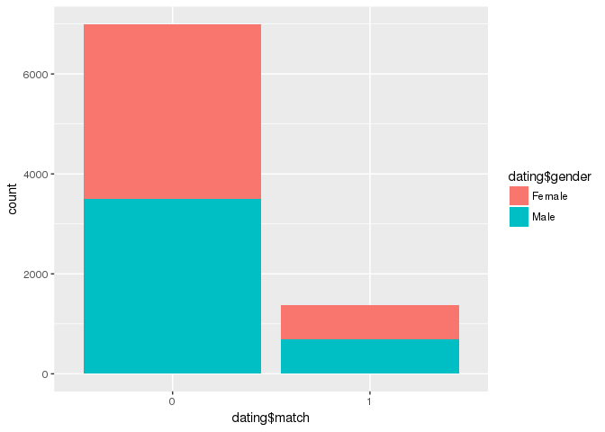

    field <- table(dating$field)
    barplot(field,main = "Field")

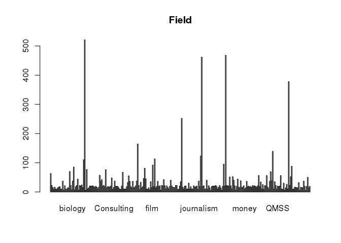

How many unique field we have in our data-set?

    length(unique(dating$field))

    ## [1] 260

    str(dating$income)

    ##  chr [1:8378] "69,487.00" "69,487.00" "69,487.00" "69,487.00" ...

    dating$income <- gsub(",","",dating$income)
    dating$income <- as.numeric(dating$income)
    #date.income <- dating %>% group_by(dating[,'iid'])
    #Error in mutate_impl(.data, dots) : not compatible with STRSXP

Error in mutate\_impl(.data, dots) : not compatible with STRSXP.
Occuring while grouping. If anyone knows the reason or solution, then
please comment.

    library(sqldf)
    date.income <- sqldf("select iid,income,age,gender,match from dating group by income")
    dim(date.income)

    ## [1] 262   5

    attach(date.income)
    a<-ggplot(date.income,aes(x=date.income$income,y=date.income$age,col=match))+
    geom_point()+xlab("Income") + ylab("Age")
    ggplotly()

<!--html_preserve-->

<!--/html_preserve-->
    dating$field<-tolower(dating$field)
    dating$field<-as.factor(dating$field)
    d<-dating[unique(dating$iid),]
    field1 <- sqldf("select field,count(*) as count from d 
                        group by field order by count DESC")
    DT::datatable(field1)

<!--html_preserve-->

<!--/html_preserve-->
    a<-ggplot(field1,aes(x=reorder(field1$field,field1$count),y=field1$count))+
      geom_bar(stat = "identity",fill="#D55E00",col="black")+
      ggtitle("Fields")+xlab("Fields")+ylab("Count")+coord_flip()
    ggplotly()

<!--html_preserve-->

<!--/html_preserve-->
    date.field <- sqldf("select field,count(*) as count from dating 
                        group by field order by count DESC")
    date<-subset(dating,dating$match==1)
    date.match <- sqldf("select field,count(*) as count from date 
                        group by field order by count DESC")

    date <- inner_join(date.field,date.match,by="field")
    names(date) <- c("field","total","matched")
    date$percentage <- (date$matched/date$total)*100
    date <-date[order(date$percentage,decreasing = T),]
    d <- head(date,30)
    a<-ggplot(d,aes(x=reorder(d$field,d$percentage),y=d$percentage))+
      geom_bar(stat = "identity",fill="#D55E00",col = "black") + 
      ggtitle("Percentage of match")+xlab("Fields")+ylab("Percentage")+coord_flip()
    ggplotly()

<!--html_preserve-->

<!--/html_preserve-->
### Variable importance for male

    dt.male <- subset(dating,dating$gender=="Male")
    attach(dt.male)

    ## The following objects are masked _by_ .GlobalEnv:
    ## 
    ##     date, field

    ## The following objects are masked from date.income:
    ## 
    ##     age, gender, iid, income, match

    f <- c("sports","tvsports","exercise","dining","museums","art","hiking","music",
           "gaming", "reading", "tv", "theater","movies", "concerts", 
             "shopping", "yoga","goal","race","exphappy")

    df.male <- subset(dt.male,select = f)
    df.male$clubbing <- dt.male$clubbing
    df.male$match <- dt.male$match
    detach(dt.male);attach(df.male)

    ## The following object is masked from date.income:
    ## 
    ##     match

    df.male <- rfImpute(match~.,df.male)

    ## ntree      OOB      1      2
    ##   300:  16.52%  1.71% 91.74%
    ## ntree      OOB      1      2
    ##   300:  16.67%  1.86% 91.88%
    ## ntree      OOB      1      2
    ##   300:  16.62%  1.71% 92.32%
    ## ntree      OOB      1      2
    ##   300:  16.62%  1.63% 92.75%
    ## ntree      OOB      1      2
    ##   300:  16.50%  1.54% 92.46%

    set.seed(69)
    model <- randomForest(match~.,
                          data = df.male,
                          ntree = 5000,importance=T)

    varImpPlot(model)

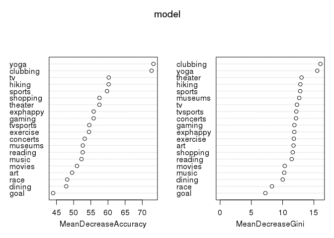

    imp.features <- tibble::rownames_to_column(data.frame(model$importance))
    names(imp.features)<- c("Variable","Imp(0)", "Imp(1)","MeanDecreaseAccuracy","MeanDecreaseGini")

    ggplot(imp.features,aes(x=reorder(imp.features$Variable,imp.features$MeanDecreaseGini),y=imp.features$MeanDecreaseGini))+
      geom_bar(stat = "identity",fill="#D55E00",colour="black")+
                           ggtitle("Variable importance for men")+xlab("Features")+
                            ylab("Importance")+coord_flip()

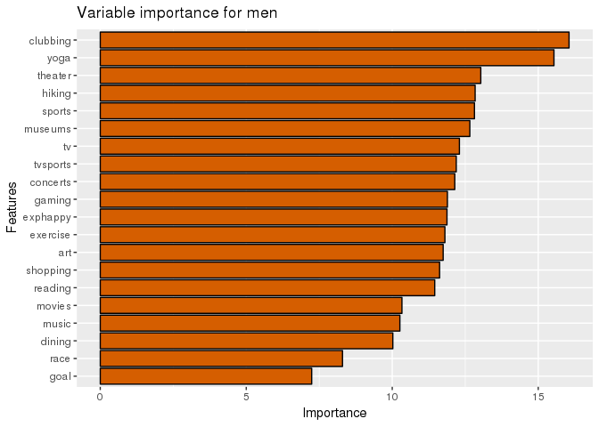

### Variable importance for female

    dt.female <- subset(dating,dating$gender=="Female")
    #View(head(dt))
    attach(dt.female)

    ## The following objects are masked _by_ .GlobalEnv:
    ## 
    ##     date, field

    ## The following objects are masked from df.male:
    ## 
    ##     art, clubbing, concerts, dining, exercise, exphappy, gaming,
    ##     goal, hiking, match, movies, museums, music, race, reading,
    ##     shopping, sports, theater, tv, tvsports, yoga

    ## The following objects are masked from date.income:
    ## 
    ##     age, gender, iid, income, match

    f <- c("sports","tvsports","exercise","dining","museums","art","hiking","music",
           "gaming", "reading", "tv", "theater","movies", "concerts", 
           "shopping", "yoga","goal","race","exphappy")

    df.female <- subset(dt.female,select = f)
    df.female$clubbing <- dt.female$clubbing
    df.female$match <- dt.female$match
    detach(dt.female)
    attach(df.female)

    ## The following objects are masked from df.male:
    ## 
    ##     art, clubbing, concerts, dining, exercise, exphappy, gaming,
    ##     goal, hiking, match, movies, museums, music, race, reading,
    ##     shopping, sports, theater, tv, tvsports, yoga

    ## The following object is masked from date.income:
    ## 
    ##     match

    df.female <- rfImpute(match~.,df.female)

    ## ntree      OOB      1      2
    ##   300:  16.59%  1.66% 92.17%
    ## ntree      OOB      1      2
    ##   300:  16.54%  1.69% 91.74%
    ## ntree      OOB      1      2
    ##   300:  16.49%  1.57% 92.03%
    ## ntree      OOB      1      2
    ##   300:  16.59%  1.75% 91.74%
    ## ntree      OOB      1      2
    ##   300:  16.44%  1.49% 92.17%

    set.seed(69)
    model.f <- randomForest(match~.,
                          data = df.female,
                          ntree = 5000,importance=T)

    varImpPlot(model.f)

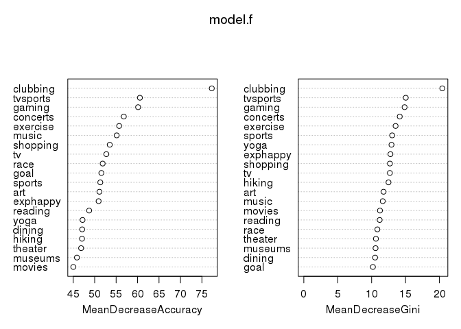

    imp.features <- tibble::rownames_to_column(data.frame(model.f$importance))
    names(imp.features)<- c("Variable","Imp(0)", "Imp(1)","MeanDecreaseAccuracy","MeanDecreaseGini")

    ggplot(imp.features,aes(x=reorder(imp.features$Variable,imp.features$MeanDecreaseGini),
                            y=imp.features$MeanDecreaseGini))+
      geom_bar(stat = "identity",fill="#D55E00", colour="black")+
      ggtitle("Variable importance for female")+xlab("Features")+
      ylab("Importance")+coord_flip()

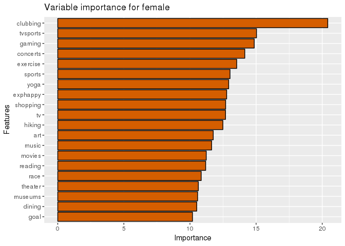

### What are the least or most desirable attributes seen in partner?

There is difference between what people say what they expect from there
date tobe whey they are asked, and what qualities they actually want.
People generally want to sound good therefore it depends on whether they
are asked or not? Let see want we get from this data. As this depends on
gender, therefore we will examine this separetly for both gender.

Examine men first
-----------------

### What you look for in the opposite sex? (When asked from men)

Lets see want people say they expect from there date, and what they
really expecting. I have added a line too so that it will be easy to see
difference.

    boxplot(dt.male[,59:64],xlab = 'Attributes',ylab = 'Count',
            main='What men says they expect from date');abline(h=16)

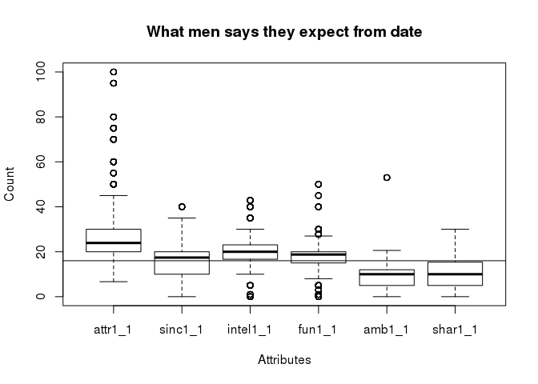

### What you think most of your fellow men look for in the opposite sex?

    boxplot(dt.male[,65:70],xlab = 'Attributes',ylab = 'Count',
            main='What men says other expects from date');abline(h=16)

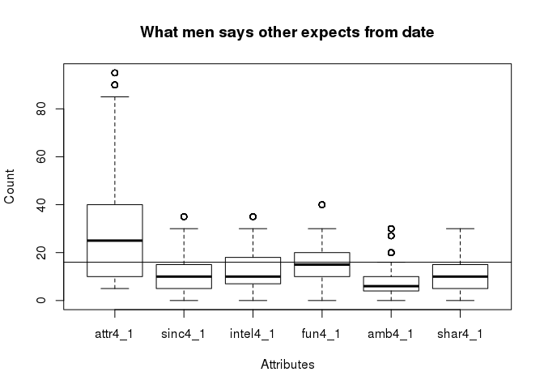

Ofcourse everyone will pretend that they are different from others,
other just look how attractive there date are but I'm different. This is
the human nature.

### What do you think the opposite sex looks for in a date?

    boxplot(dt.male[,130:135],xlab = 'Attributes',ylab = 'Count',
            main='What opposite sex expects from date');abline(h=16)

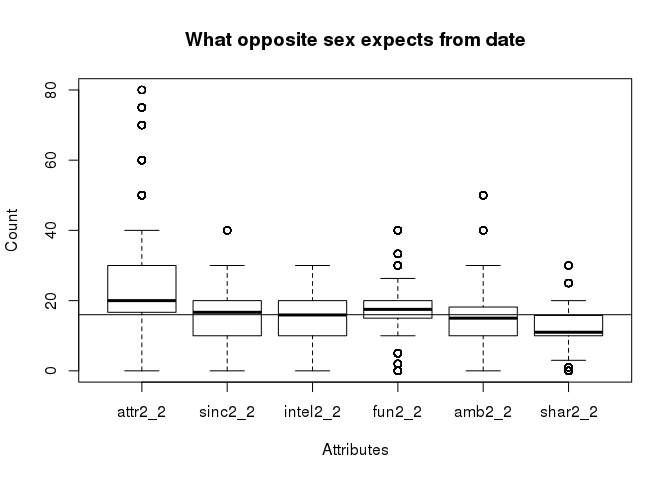

### Now let's see what they really expecting or looking

    dt1 <- dt.male %>% select(iid, match,pid, dec, gender, attr, sinc, intel, fun, amb, shar, like, prob)
    dt0 <- dt.female %>% select(iid, match,pid, dec, gender, attr, sinc, intel, fun, amb, shar, like, prob)

    d <- subset(dt1,dt1$match==1)
    boxplot(d[,6:11],xlab = 'Attributes',ylab = 'Count',
            main='What men actullay wants');abline(h=7)

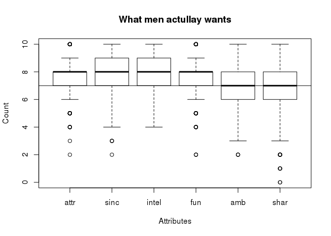

As we can see men are more attracted towards attractive, sincere,
intelligent and fun while not attracted that much towards ambitious and
shared interest

Examine female
--------------

### What you look for in the opposite sex? (When asked from women)

    boxplot(dt.female[,59:64],xlab = 'Attributes',ylab = 'Count',
            main='What women says they expect from date');abline(h=16)

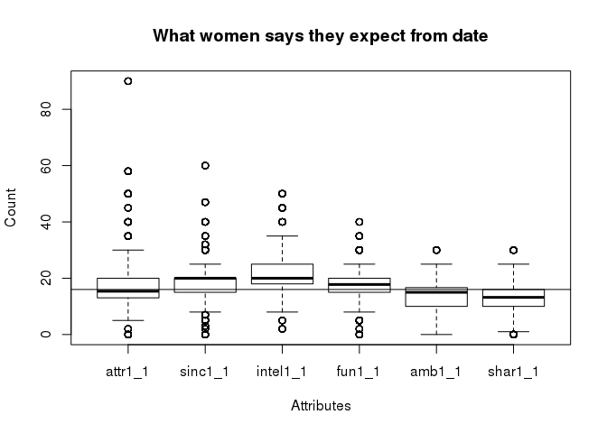

### What you think most of your fellow women look for in the opposite sex?.

    boxplot(dt.female[,65:70],xlab = 'Attributes',ylab = 'Count',
            main='What women says other expects from date');abline(h=16)

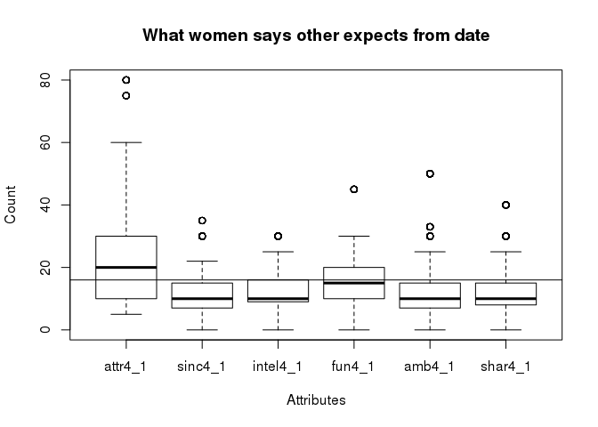

Same goes for the female.

### What do you think the opposite sex looks for in a date?

    boxplot(dt.female[,130:135],xlab = 'Attributes',ylab = 'Count',
            main='What opposite sex expects from date');abline(h=16)

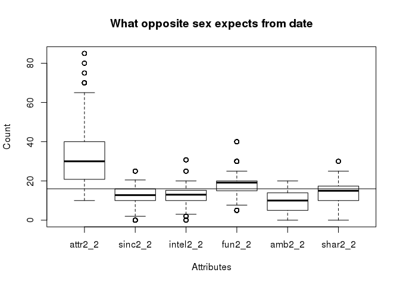

### What they are really expecting from their date

    rm(d)
    d <- subset(dt0,dt0$match==1)
    boxplot(d[,6:11],xlab = 'Attributes',ylab = 'Count',
            main='What women actullay wants');abline(h=7)

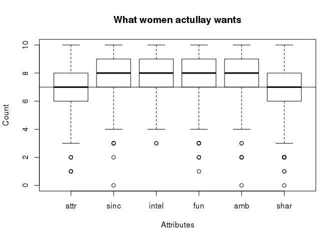

Unlike men, women are more attracted towards sincere, intelligent,
fun,ambitious compared to attractive and shared interest.
